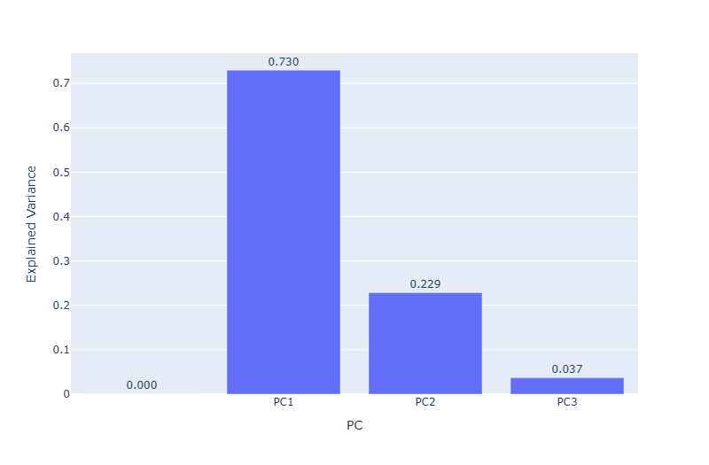
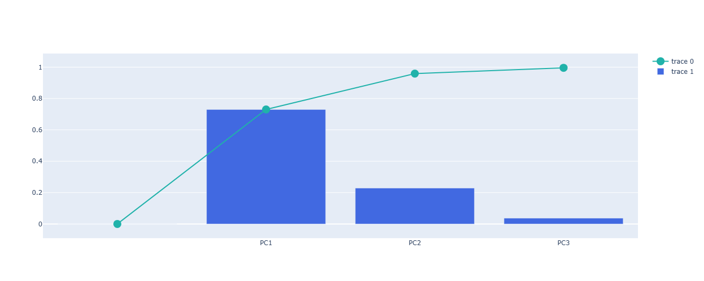
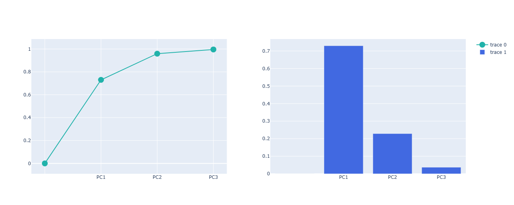
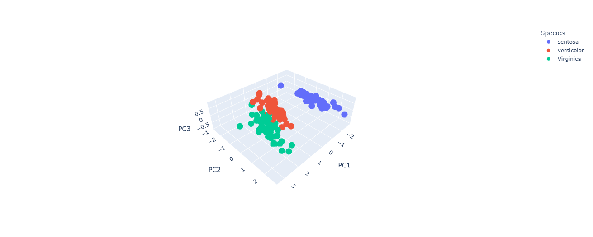
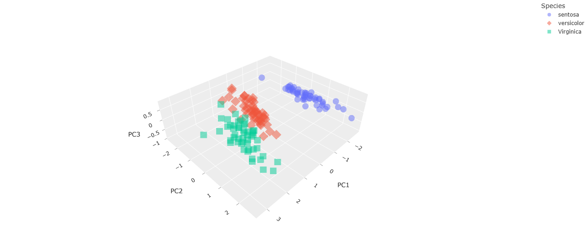
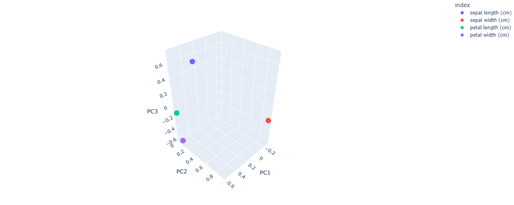

# 🌌 Principal Component Analysis (PCA) for Handling High-Dimensional Data

> Compressing a 4-feature dataset down to its 2 most important dimensions — without losing the story the data is telling. Built on the Iris dataset as a clean, well-understood case study for dimensionality reduction.


---

## ⚡ TL;DR — 30-Second Summary

- **Problem:** Every extra feature in a dataset adds computational cost — and not every feature carries unique information. How much can be safely thrown away?
- **Approach:** Standardize the Iris dataset (Z-score), fit PCA with 3 components, then analyze *how much* variance each component actually explains — visualized three different ways — before inspecting how the data and its original features look in the new PCA space.
- **Result:** The first 2 principal components alone retain **95.9%** of the original information from the 4 original features. The 3rd component only adds another 3.7%, making it a strong candidate to drop entirely.
- **What makes this more than "just call `PCA()`":** the explained variance is visualized three separate ways (bar-only, combined, side-by-side) to show *different lenses* on the same decision, and the abstract `components_` loadings matrix is turned into an actual 3D plot so "which features drive PC1?" has a visual answer, not just a table of numbers.

---

## 💼 Skills Demonstrated

| Competency | Where it shows up |
|---|---|
| **Dimensionality Reduction** | Fitting PCA, retrieving scores and loadings, and reasoning about how many components are actually worth keeping |
| **Feature Standardization** | Z-score scaling before PCA — and explaining *why* skipping this step would bias the result |
| **Statistical Interpretation** | Reading explained variance and cumulative variance to make a concrete "keep vs. drop" decision, not just reporting numbers |
| **Interactive Data Visualization** | Building Scree Plots, 3D score plots, and a 3D loading plot with Plotly |
| **Array Manipulation** | Using `np.insert` and `np.cumsum` deliberately to make a plot mathematically and visually correct, not just "close enough" |

---

## 📑 Table of Contents

- [Project Overview](#-project-overview)
- [Objectives](#-objectives)
- [Dataset](#-dataset)
- [The Math & Logic Behind PCA](#-the-math--logic-behind-pca)
- [Analysis Workflow](#-analysis-workflow)
- [Visualizations & Insights](#-visualizations--insights)
- [Conclusion](#-conclusion)
- [Notes](#-notes)
- [Tech Stack](#️-tech-stack)
- [How to Run](#️-how-to-run)
- [Project Structure](#️-project-structure)
- [Acknowledgments & Credits](#-acknowledgments--credits)
- [Author](#-author)

---

## 📖 Project Overview

This project demonstrates **Principal Component Analysis (PCA)** for dimensionality reduction on a dataset with multiple correlated features. Using the classic **Iris dataset** as a case study, it shows how to compress 4 original measurements into a smaller set of "principal components" — new, uncorrelated axes engineered to capture as much of the original variance as possible — and how to decide, with actual numbers rather than intuition, how many of those components are worth keeping.

---

## 🎯 Objectives

- Understand why features need to be standardized before PCA, and what goes wrong if that step is skipped.
- Fit a PCA model and correctly interpret its two core outputs: **scores** (the transformed data) and **loadings** (how much each original feature contributes to each component).
- Use **explained variance** and **cumulative variance** to make a concrete decision about how many components to keep.
- Visualize both the transformed data and the original feature relationships in the new PCA space.

---

## 📂 Dataset

**Dataset:** The classic Iris dataset, loaded via `sklearn.datasets.load_iris()` — 150 samples across 3 species (**Setosa**, **Versicolor**, **Virginica**), described by 4 numeric features.

| Feature | Description |
|---|---|
| `sepal length (cm)` | Length of the sepal |
| `sepal width (cm)` | Width of the sepal |
| `petal length (cm)` | Length of the petal |
| `petal width (cm)` | Width of the petal |

---

## 🧮 The Math & Logic Behind PCA

### 1. Data Scaling & Z-Score Standardization

Before PCA runs, every feature needs to be put on the same footing — otherwise a feature with naturally larger numbers (like petal length in cm vs. a ratio between 0 and 1) would dominate the analysis purely because of its scale, not because it's actually more informative.

$$Z = \frac{x - \mu}{\sigma}$$

- $Z$ = the standardized value
- $x$ = the original data value
- $\mu$ = the mean of that feature
- $\sigma$ = the standard deviation of that feature

`scikit-learn`'s `scale(X)` function applies this to every column, giving each feature a mean of 0 and a standard deviation of 1 — leveling the playing field before PCA ever looks at the data.

### 2. PCA & `components_` (Loadings)

PCA works by finding new axes — linear combinations of the original features — that capture the maximum possible spread (variance) in the data, one axis at a time.

- `PCA(n_components=3)` instructs the model to find the 3 most informative axes.
- `pca.components_` is the **loadings matrix** — it shows how strongly each original feature contributes to each new component. A large loading means that feature is a major driver of that particular axis.

### 3. `np.insert` & `np.cumsum` — Making the Scree Plot Make Sense

Two small `numpy` operations do a lot of work in preparing the Scree Plot:

- **`np.insert(explained_variance, 0, 0)`** inserts a `0` at the very start of the array, so the plot has a logical starting point at $(0, 0)$ — visually confirming that with zero components used, zero information is captured.
- **`np.cumsum(...)`** computes the running total of explained variance from left to right, turning "PC1 explains 73.0%, PC2 explains 22.9%" into a single cumulative answer: *how much total information do I have once I've added this many components?*

---

## 🔄 Analysis Workflow

```text
1. Iris Dataset
      └── Load data, inspect features/targets, assign X (features) and y (species)
      │
      ▼
2. PCA Analysis
      ├── Standardize X with Z-score scaling
      ├── Fit PCA(n_components=3, random_state=42)
      ├── Extract scores (transformed data) and loadings (components_)
      └── Extract explained_variance_ratio_
      │
      ▼
3. Scree Plot
      ├── Prepare explained variance (np.insert for a clean 0-point)
      ├── Compute cumulative variance (np.cumsum)
      └── Visualize 3 ways: bar-only, combined, side-by-side
      │
      ▼
4. Scores Plot
      ├── Basic 3D scatter of the transformed data, colored by species
      └── Customized 3D scatter (distinct symbols per species, styled theme)
      │
      ▼
5. Loading Plot
      └── 3D scatter of the loadings — visualizing which original features
          drive which principal component
```

---

## 📊 Visualizations & Insights

*All visualizations below were built with Plotly on the fitted PCA model.*

### 3.2.4.1. Explained Variance



> **Insight:** PC1 alone explains **73.0%** of the total variance, PC2 adds another **22.9%**, and PC3 contributes just **3.7%**. Already, two components are doing almost all of the work.

### 3.2.4.2. Explained Variance + Cumulative Variance (Combined)



> **Insight:** Overlaying the cumulative variance (line) on top of the per-component variance (bars) turns the same numbers into a decision tool: the cumulative line crosses **95.9%** by PC2, and barely moves after that — a visual "elbow" showing diminishing returns from adding a 3rd component.

### 3.2.4.3. Explained Variance + Cumulative Variance (Side-by-Side)



> **Insight:** The same two signals — individual and cumulative variance — presented as separate subplots instead of overlaid. Useful when the combined view (above) feels visually cluttered and each trend is easier to read on its own axis.

### 4.2. Basic 3D Scatter Plot



> **Insight:** Plotting the data in the new PC1–PC2–PC3 space (rather than the original 4 features) already shows **Setosa** (blue) separating cleanly into its own region, while **Versicolor** and **Virginica** sit closer together — hinting that those two species are more similar to each other than either is to Setosa.
>
> *(Note: the legend in this plot reads "sentosa" — a small typo in the original label-mapping code, kept as-is since it's baked into the rendered image; the species is Setosa.)*

### 4.3. Customized 3D Scatter Plot



> **Insight:** The same plot, refined for readability — distinct marker symbols per species (not just color, which helps colorblind-accessibility too), partial transparency to reveal overlapping points, and a cleaner visual theme. The separation story doesn't change, but it's easier to read at a glance.

### 5. Loading Plot



> **Insight:** This plot isn't showing flowers anymore — it's showing the 4 *original features* themselves, positioned by how much they contribute to each principal component. **Petal length** and **petal width** sit close to each other, indicating they're highly correlated and are the main drivers of PC1 — which lines up with petal measurements being the most distinctive trait between Iris species.

---

## 🚀 Conclusion

Through PCA, the original 4-feature Iris dataset can be compressed down to just **2 principal components** while retaining **95.9%** of its total variance. Feeding all 4 raw features into a downstream ML model would be computational overkill for the amount of unique information gained from the 3rd and 4th dimensions — PC1 and PC2 alone capture almost the entire story, at a fraction of the dimensionality.

---

## 📝 Notes

- `pca.components_` and the `random_state=42` used during fitting make the results reproducible — re-running the notebook should reproduce the same scores, loadings, and explained variance shown here.
- The species label "sentosa" appearing in the Scores Plot images (see above) is a minor typo inherited from the original label-mapping code — it doesn't affect any of the underlying math, only the legend text in two of the plots.

---

## 🛠️ Tech Stack

| Category | Tools |
|---|---|
| Language | Python |
| Machine Learning | `scikit-learn` (`PCA`, `scale`) |
| Data Handling | `pandas`, `numpy` |
| Visualization | `Plotly` (Express & Graph Objects) |
| Environment | Jupyter Notebook / Google Colab |

---

## ▶️ How to Run

### Option 1 — Run on Google Colab (Recommended)

1. Open `Principal_Component_Analysis_(PCA)_for_Handling_High_Dimensional_Data.ipynb` in Google Colab.
2. Run all notebook cells from top to bottom.
3. The Iris dataset loads automatically from `scikit-learn` — no external downloads needed.

### Option 2 — Run Locally

**1. Clone the repository**
```bash
git clone https://github.com/RoihansLab/Machine-Learning-Projects.git
cd Machine-Learning-Projects/08_Principal_Component_Analysis_(PCA)_for_Handling_High_Dimensional_Data
```

**2. Install the required Python libraries**
```bash
pip install pandas numpy scikit-learn plotly jupyter
```

**3. Launch Jupyter Notebook**
```bash
jupyter notebook "Principal_Component_Analysis_(PCA)_for_Handling_High_Dimensional_Data.ipynb"
```

---

## 🗂️ Project Structure

```text
08_Principal_Component_Analysis_(PCA)_for_Handling_High_Dimensional_Data/
│
├── Principal_Component_Analysis_(PCA)_for_Handling_High_Dimensional_Data.ipynb
│                                                → Full workflow: scaling, PCA fitting, scree plots,
│                                                  3D score plots, and the loading plot
├── images/
│   ├── scree_plot_explained_variance.png
│   ├── scree_plot_combined.png
│   ├── scree_plot_subplots.png
│   ├── scores_plot_basic_3d.png
│   ├── scores_plot_customized_3d.png
│   └── loading_plot_3d.png
└── README.md                                    → You are here
```

---

## 🙏 Acknowledgments & Credits

A heartfelt thank you to **Data Professor** on YouTube. The fundamental understanding and hands-on practice behind this project were made possible by his excellent, clearly explained tutorial. Supporting and crediting the creators who make quality Machine Learning education freely accessible is something I take seriously as part of this developer community.

📺 [Principal Component Analysis (PCA) in Python](https://youtu.be/oiusrJ0btwA)

---

## 👤 Author

**Roihan Saputra**
*Aspiring Data Scientist / Machine Learning Engineer*
GitHub: [https://github.com/RoihansLab](https://github.com/RoihansLab)

Open to feedback, collaboration, or a conversation about this project — feel free to reach out via GitHub.
